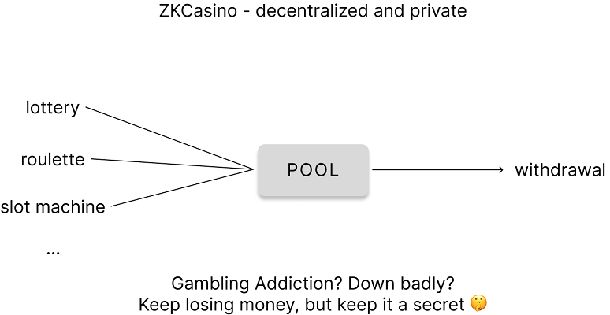

# zkcasino
A decentralized casino where you can keep your wins (and losses) private, powered by zk-SNARKs.

An oddly familiar feel to the now defunct protocol called something like _'Cyclone Currency'_, this time with a twist:

>The house can take your money, in a cryptographically sound and provably fair way.

Currently discontinued: for it to work it would require a random number to be generated and stored every block.

## Build

## How it Works

## Possible Upgrades

## Acknowledgements 
ZKCasino is inspired on the [Zero Knowledge Lottery](https://killari.medium.com/zero-knowledge-lottery-437e456dc3f2) idea by [@Qhuesten](https://twitter.com/qhuesten). One of the main problems with that implementation is the need to have a random number for each block that can later be accessed via a smart contract. This would make it possible to have a ZKCasino where the users can bet with however much they wish. Until that is widely available, we are forced to use fixed bet amounts that get hardcoded into the smart contracts.

The base logic for the circuits and smart contracts is based on that of Cyclone Currency (mixing service that should not be named). Although the original source code has been removed from GitHub, you can still find it in [this repository](https://github.com/tornado-repositories). Huge thanks go to [Matthew D. Green](https://isi.jhu.edu/~mgreen/) for compiling all of it neatly and making it widely accessible.

Cyclone Currency original implementation uses Pederson and MiMC hash functions, whereas this readaptation uses the ZK-friendly Poseidon hash function, as previously done by [@ChihChengLiang](https://github.com/ChihChengLiang) in his [Poseidon Tornado](https://github.com/ChihChengLiang/poseidon-tornado) implementation.

The proving scheme being used is groth16, which needs a trusted setup to work. For this we are using the [trusted setup provided by iden3](https://github.com/iden3/snarkjs#7-prepare-phase-2), with a total of 54 contributions. However, were we to obtain one with more contributions, the smart contract could update to the corresponding new verifier.

## Disclaimers
In case of an investigation by any federal entity or similar, this is a simple software project aimed to explore the applications of zero knowledge proofs and expand on their use cases. The autonomous smart contracts (that could not qualify as a legal person) will only be deployed on test networks with FAKE funds.
